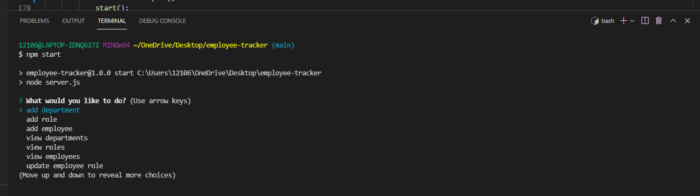

# employee-tracker

## Description

A database for an employer to track employees by name, department, and roles.

Employee Tracker allows you to 

- Add departments, roles, and employees
- View departments, roles, and employees
- Update employee roles

## Installation

- NPM
- INQUIRER
- MYSQL

## Link

- GITHUB: https://github.com/melbrewer323/employee-tracker

